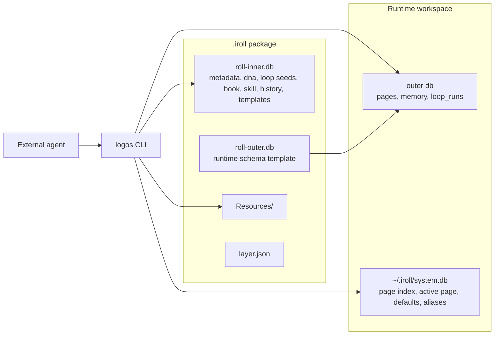
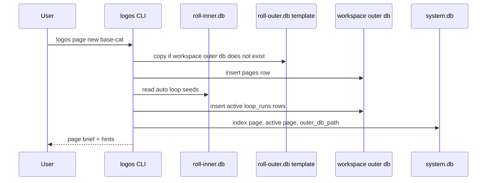

# Iroll v0.2.0 Architecture

GitHub: [WangLeiIS/ai-logos](https://github.com/WangLeiIS/ai-logos)

This document describes the current `.iroll` package architecture in Logos v0.2.0. It is meant to explain the system model that agents and developers should rely on today.

The central idea is simple: an `.iroll` package is an agent state bundle. Logos does not run an agent or call a model. Logos stores the agent's stable blueprint, creates page-scoped runtime state, and exposes resolved context for an external agent to consume.

## Design Principles

- Logos does not integrate agent ability. Agents use Logos.
- The package blueprint is separate from runtime state.
- A page is the unit of conversation and work.
- Loop runs are visible state, not a scheduler. The agent decides what to do with them.
- Context is stored as JSON markers and resolved only when read.

## Package Layout

After build or load, a package version lives under:

```text
~/.iroll/<name>/<version>/
  roll-inner.db
  roll-outer.db
  Resources/
  layer.json
  workspace/
    .<name>.outer.db
```

Inside an exported `.iroll` ZIP:

```text
roll-inner.db
roll-outer.db
Resources/
layer.json
```

`roll-inner.db` is the built blueprint. `roll-outer.db` is the runtime template copied into workspaces.

## System Overview



## Inner And Outer Databases

Logos v0.2.0 splits package data into two SQLite databases.

### `roll-inner.db`

`roll-inner.db` is created at build time and treated as read-only during normal use.

It contains:

| Table | Purpose |
|---|---|
| `metadata` | Package and agent metadata, including `name`, `version`, `system_prompt`, and `response_contract`. |
| `dna` | Decision genes: `name`, `type`, `question`, `answer`, `weight`. |
| `loop` | Reusable loop seeds: `auto` or `normal`. |
| `book` | Registered book bundles. |
| `skill` | Registered skills. |
| `history` | Build history. |
| `pages` | Template page row, normally `page_id = '0'`. |
| `memory` | Template memory rows, normally `page_id = '0'`. |

### `roll-outer.db`

`roll-outer.db` is a template copied to the runtime workspace. It contains mutable page-scoped state.

It contains:

| Table | Purpose |
|---|---|
| `pages` | Runtime pages and their raw context JSON. |
| `memory` | Page-isolated memory. |
| `loop_runs` | Active, completed, and aborted loop run records. |

## SQLite Attach Model

At runtime Logos opens the outer database as the main SQLite database and attaches the inner database:

```sql
ATTACH DATABASE '<path>/roll-inner.db' AS inner;
```

The rule is:

- Bare table names refer to the outer database.
- `inner.<table>` refers to the inner database.

Examples:

```sql
SELECT * FROM pages;
SELECT * FROM inner.dna ORDER BY weight DESC;
SELECT * FROM loop_runs WHERE page_id = ?;
SELECT * FROM inner.loop WHERE archived_at IS NULL;
```

This keeps page state mutable while keeping the package blueprint stable.

## Irollfile Build Model

An `Irollfile` defines how a package is built.

Current instructions:

```text
FROM <name[:version]>
MIGRATE <sql-file>
MIGRATE OUTER <sql-file>
COPY <src> <dest>
```

Instruction behavior:

| Instruction | Target |
|---|---|
| `FROM` | Copies an existing package version as a base layer. |
| `MIGRATE` | Executes SQL against `roll-inner.db`. |
| `MIGRATE OUTER` | Executes SQL against `roll-outer.db`. |
| `COPY` | Copies files into the package directory, usually under `Resources/`. |

The base agent uses:

```text
MIGRATE init_inner.sql
MIGRATE init_data.sql
MIGRATE OUTER init_outer.sql
COPY greeting.txt Resources/greeting.txt
COPY books Resources/books
```

`init_inner.sql` defines blueprint tables. `init_data.sql` seeds package data and the template page. `init_outer.sql` defines runtime tables.

## Page Lifecycle

`logos page new <iroll>` creates a page and prepares runtime state.



Important details:

- `page new` returns a brief page record, not the full resolved context.
- The full context is read with `logos page get`.
- If no explicit cwd is supplied, Logos uses the package workspace.
- If an explicit cwd is supplied, Logos creates an outer database under `<cwd>/.iroll/<name>.db`.

## Context Model

Raw page context is stored as JSON in `pages.context`. It may contain literal values and markers.

Supported marker types:

```json
{"@file": "Resources/greeting.txt"}
{"@sql": "SELECT value FROM inner.metadata WHERE key = 'system_prompt'"}
```

When context is read with `logos page get`, Logos resolves:

- literal JSON values as-is;
- `@file` markers into file content;
- `@sql` markers into query results;
- dynamic loop state into top-level keys.

The base agent template context currently includes:

```json
{
  "system_prompt": {
    "@sql": "SELECT value FROM inner.metadata WHERE key = 'system_prompt'"
  },
  "response_contract": {
    "@sql": "SELECT value FROM inner.metadata WHERE key = 'response_contract'"
  },
  "dna": {
    "@sql": "SELECT name, type, weight, question, answer FROM inner.dna ORDER BY weight DESC"
  },
  "user_context": {}
}
```

`user_context` is a convention key for caller-specific or page-specific additions.

### Dynamic Context Keys

`ResolveContext` adds loop state when context is read:

| Key | Meaning |
|---|---|
| `loop_focus` | Active loop runs for the current page. |
| `loop_available` | Non-archived normal loop seeds that can be started manually. |

Auto loop seeds do not appear in `loop_available` because they have already been started and appear in `loop_focus`.

## Loop Model

Loop seeds live in `inner.loop`. Loop runs live in the outer database.

### Seeds

Seed fields include:

- `name`
- `type`: `auto` or `normal`
- `describe`
- `content`
- `weight`
- `archived_at`

Seed types:

| Type | Behavior |
|---|---|
| `auto` | Automatically starts an active run when a page is created. |
| `normal` | Appears in `loop_available` and can be started by the agent or user. |

### Runs

Runs are stored in `loop_runs` and are page-scoped.

Run lifecycle:

```text
active -> completed
active -> aborted
```

Runs snapshot seed fields at start time:

- `seed_name`
- `seed_describe`
- `seed_content`
- `seed_weight`

This preserves the historical meaning of a run even if the seed later changes.

## System Database

`~/.iroll/system.db` tracks global local state.

Important tables:

| Table | Purpose |
|---|---|
| `page_index` | All known pages, including iroll name, version, cwd, alias, and outer db path. |
| `active_page` | Active page per cwd. |
| `config` | Global config, including defaults and hub credentials. |

`outer_db_path` is important because page commands need to reopen the correct runtime database.

## CLI Output Model

High-frequency commands use structured multi-line JSON.

Success:

```json
{"status":"ok"}
{"page_id":"...","cwd":"..."}
{"hints":[{"action":"...","cmd":"..."}]}
```

Failure:

```json
{"status":"error","code":"...","error":"..."}
{"hints":[{"action":"...","cmd":"..."}]}
```

Some older commands still use the legacy single-line output format.

## Base Cat Example

`examples/base-agent` is the current reference package.

It seeds:

- `metadata.name = base-cat`
- `metadata.version = 0.2.0`
- `metadata.system_prompt`
- `metadata.response_contract`
- four DNA rows:
  - two `idea` rows;
  - two `emotion` rows.
- one auto loop seed:
  - `observe-human`
- one normal loop seed:
  - `ramble`

When a page is created:

- `observe-human` starts automatically and appears in `loop_focus`;
- `ramble` appears in `loop_available`;
- `dna`, `system_prompt`, `response_contract`, and `user_context` appear in resolved context.

## Minimal Command Flow

Build the CLI:

```bash
cd iroll
go build -o ../logos .
cd ..
```

Build the base package:

```bash
./logos roll build -f examples/base-agent/Irollfile -t base-cat:0.2.0
```

Create a page:

```bash
./logos page new base-cat
```

Read resolved context:

```bash
./logos page get --roll base-cat
```

Read one key:

```bash
./logos page get dna --roll base-cat
./logos page get loop_focus --roll base-cat
```

Update page-specific context:

```bash
./logos page set user_context.preferred_tone '"quiet"'
./logos page unset user_context.preferred_tone
```

Inspect loop state:

```bash
./logos loop ps
./logos loop list --stats
```

Run the normal ramble loop:

```bash
./logos loop run ramble --plan '{"reason":"needs full sentence"}'
```

## Agent Usage Contract

An external agent should use Logos like this:

1. Read context with `logos page get`.
2. Treat `system_prompt`, `response_contract`, and `dna` as the current behavioral context.
3. Treat `loop_focus` as active obligations or ongoing state.
4. Treat `loop_available` as optional behaviors the agent may start.
5. Store page-specific observations under `user_context` or in page memory.
6. Update or complete loop runs using loop commands when the agent acts on them.

Logos stores and exposes state. The agent performs the work.

## What v0.2.0 Does Not Do

- It does not call an LLM.
- It does not automatically execute loop content.
- It does not decide when to start normal loops.
- It does not infer book query tags from natural language.
- It does not merge runtime outer databases back into the package blueprint.

These boundaries are intentional. They keep Logos as a state and context substrate rather than an agent runtime.
