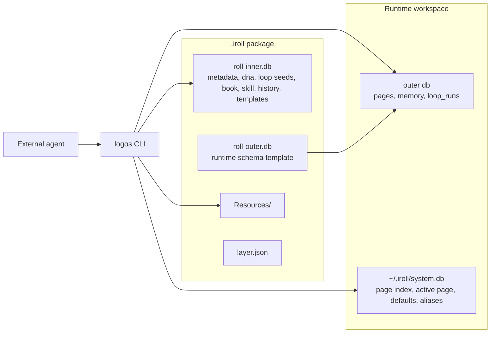
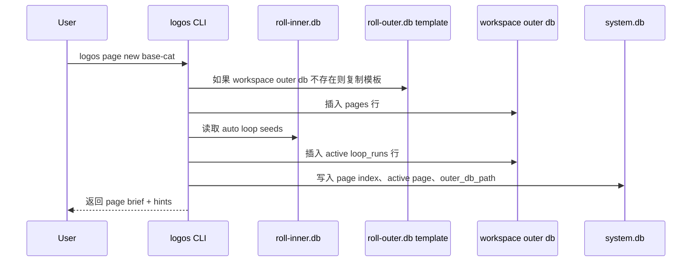

# Iroll v0.2.0 架构说明

GitHub: [WangLeiIS/ai-logos](https://github.com/WangLeiIS/ai-logos)

本文说明 Logos v0.2.0 中当前 `.iroll` 包的架构。它面向需要理解系统模型的 agent 使用者和开发者。

一句话概括：`.iroll` 是一个 agent 状态包。Logos 不运行 agent，也不调用模型；Logos 负责保存 agent 的稳定蓝图、创建 page 级运行态，并把解析后的 context 暴露给外部 agent 使用。

## 设计原则

- Logos 不集成 agent 能力，而是让 agent 使用 Logos。
- 包的蓝图与运行态分离。
- page 是对话和工作的基本单元。
- loop run 是 agent 可见的状态记录，不是调度器；agent 自己决定如何执行。
- context 以 JSON marker 形式存储，只在读取时解析。

## 包结构

构建或加载后，一个包版本位于：

```text
~/.iroll/<name>/<version>/
  roll-inner.db
  roll-outer.db
  Resources/
  layer.json
  workspace/
    .<name>.outer.db
```

导出的 `.iroll` ZIP 包内部包含：

```text
roll-inner.db
roll-outer.db
Resources/
layer.json
```

`roll-inner.db` 是构建出的蓝图数据库。`roll-outer.db` 是运行态模板，会被复制到 workspace 中使用。

## 系统总览



## Inner 与 Outer 数据库

Logos v0.2.0 将包数据拆分成两个 SQLite 数据库。

### `roll-inner.db`

`roll-inner.db` 在构建时创建，正常运行时视为只读。

它包含：

| 表 | 作用 |
|---|---|
| `metadata` | 包和 agent 元数据，包括 `name`、`version`、`system_prompt`、`response_contract`。 |
| `dna` | 决策基因：`name`、`type`、`question`、`answer`、`weight`。 |
| `loop` | 可复用 loop 种子，类型为 `auto` 或 `normal`。 |
| `book` | 已注册的 Book Bundle。 |
| `skill` | 已注册的技能。 |
| `history` | 构建历史。 |
| `pages` | 模板 page 行，通常为 `page_id = '0'`。 |
| `memory` | 模板 memory 行，通常为 `page_id = '0'`。 |

### `roll-outer.db`

`roll-outer.db` 是会复制到运行 workspace 的模板数据库。它包含可变的 page 级状态。

它包含：

| 表 | 作用 |
|---|---|
| `pages` | 运行时 page 和原始 context JSON。 |
| `memory` | page 隔离的记忆。 |
| `loop_runs` | active、completed、aborted 状态的 loop run 记录。 |

## SQLite Attach 模型

运行时 Logos 会打开 outer 数据库作为主库，并 attach inner 数据库：

```sql
ATTACH DATABASE '<path>/roll-inner.db' AS inner;
```

规则是：

- 不带前缀的表名访问 outer 数据库。
- `inner.<table>` 访问 inner 数据库。

示例：

```sql
SELECT * FROM pages;
SELECT * FROM inner.dna ORDER BY weight DESC;
SELECT * FROM loop_runs WHERE page_id = ?;
SELECT * FROM inner.loop WHERE archived_at IS NULL;
```

这个模型让 page 状态可写，同时让包蓝图保持稳定。

## Irollfile 构建模型

`Irollfile` 定义包如何构建。

当前支持四条指令：

```text
FROM <name[:version]>
MIGRATE <sql-file>
MIGRATE OUTER <sql-file>
COPY <src> <dest>
```

指令行为：

| 指令 | 目标 |
|---|---|
| `FROM` | 复制一个已有包版本作为基础层。 |
| `MIGRATE` | 在 `roll-inner.db` 上执行 SQL。 |
| `MIGRATE OUTER` | 在 `roll-outer.db` 上执行 SQL。 |
| `COPY` | 复制文件到包目录，通常放在 `Resources/` 下。 |

base agent 使用：

```text
MIGRATE init_inner.sql
MIGRATE init_data.sql
MIGRATE OUTER init_outer.sql
COPY greeting.txt Resources/greeting.txt
COPY books Resources/books
```

`init_inner.sql` 定义蓝图表。`init_data.sql` 写入包数据和模板 page。`init_outer.sql` 定义运行态表。

## Page 生命周期

`logos page new <iroll>` 会创建一个 page 并准备运行态。



重要细节：

- `page new` 返回 page brief，不返回完整解析后的 context。
- 完整 context 使用 `logos page get` 读取。
- 如果不显式传 cwd，Logos 使用包内 workspace。
- 如果显式传 cwd，Logos 会在 `<cwd>/.iroll/<name>.db` 创建 outer 数据库。

## Context 模型

原始 page context 存储在 `pages.context` 中，是 JSON。它可以包含普通 JSON 值，也可以包含 marker。

支持的 marker 类型：

```json
{"@file": "Resources/greeting.txt"}
{"@sql": "SELECT value FROM inner.metadata WHERE key = 'system_prompt'"}
```

读取 context 时，`logos page get` 会解析：

- 普通 JSON 值保持不变；
- `@file` marker 解析为文件内容；
- `@sql` marker 解析为 SQL 查询结果；
- 动态 loop 状态注入到顶层 key。

base agent 的模板 context 当前包含：

```json
{
  "system_prompt": {
    "@sql": "SELECT value FROM inner.metadata WHERE key = 'system_prompt'"
  },
  "response_contract": {
    "@sql": "SELECT value FROM inner.metadata WHERE key = 'response_contract'"
  },
  "dna": {
    "@sql": "SELECT name, type, weight, question, answer FROM inner.dna ORDER BY weight DESC"
  },
  "user_context": {}
}
```

`user_context` 是约定 key，用于调用方或 page 级的自定义上下文。

### 动态 Context Key

`ResolveContext` 在读取 context 时会加入 loop 状态：

| Key | 含义 |
|---|---|
| `loop_focus` | 当前 page 的 active loop runs。 |
| `loop_available` | 可手动启动的、未归档的 normal loop seeds。 |

auto loop seed 不会出现在 `loop_available` 中，因为它们已经自动启动，并出现在 `loop_focus` 中。

## Loop 模型

Loop seed 存在 `inner.loop` 中。Loop run 存在 outer 数据库中。

### Seed

seed 字段包括：

- `name`
- `type`: `auto` 或 `normal`
- `describe`
- `content`
- `weight`
- `archived_at`

seed 类型：

| 类型 | 行为 |
|---|---|
| `auto` | 创建 page 时自动启动 active run。 |
| `normal` | 出现在 `loop_available` 中，可由 agent 或用户主动启动。 |

### Run

run 存储在 `loop_runs` 中，并且按 page 隔离。

run 生命周期：

```text
active -> completed
active -> aborted
```

run 启动时会快照 seed 字段：

- `seed_name`
- `seed_describe`
- `seed_content`
- `seed_weight`

这样即使 seed 后续变化，历史 run 的语义仍然稳定。

## System 数据库

`~/.iroll/system.db` 跟踪本地全局状态。

重要表：

| 表 | 作用 |
|---|---|
| `page_index` | 所有已知 page，包含 iroll 名称、版本、cwd、alias、outer db 路径。 |
| `active_page` | 每个 cwd 当前活跃 page。 |
| `config` | 全局配置，包括默认 page 和 hub 凭证。 |

`outer_db_path` 很关键，因为 page 命令需要重新打开正确的运行态数据库。

## CLI 输出模型

高频命令使用结构化多行 JSON。

成功：

```json
{"status":"ok"}
{"page_id":"...","cwd":"..."}
{"hints":[{"action":"...","cmd":"..."}]}
```

失败：

```json
{"status":"error","code":"...","error":"..."}
{"hints":[{"action":"...","cmd":"..."}]}
```

部分旧命令仍然使用旧的单行输出格式。

## Base Cat 示例

`examples/base-agent` 是当前参考包。

它写入：

- `metadata.name = base-cat`
- `metadata.version = 0.2.0`
- `metadata.system_prompt`
- `metadata.response_contract`
- 四条 DNA：
  - 两条 `idea`
  - 两条 `emotion`
- 一个 auto loop seed：
  - `observe-human`
- 一个 normal loop seed：
  - `ramble`

创建 page 时：

- `observe-human` 自动启动并出现在 `loop_focus` 中；
- `ramble` 出现在 `loop_available` 中；
- `dna`、`system_prompt`、`response_contract`、`user_context` 出现在解析后的 context 中。

## 最小命令流

构建 CLI：

```bash
cd iroll
go build -o ../logos .
cd ..
```

构建 base package：

```bash
./logos roll build -f examples/base-agent/Irollfile -t base-cat:0.2.0
```

创建 page：

```bash
./logos page new base-cat
```

读取解析后的 context：

```bash
./logos page get --roll base-cat
```

读取单个 key：

```bash
./logos page get dna --roll base-cat
./logos page get loop_focus --roll base-cat
```

更新 page 级 context：

```bash
./logos page set user_context.preferred_tone '"quiet"'
./logos page unset user_context.preferred_tone
```

查看 loop 状态：

```bash
./logos loop ps
./logos loop list --stats
```

启动 normal 类型的 ramble loop：

```bash
./logos loop run ramble --plan '{"reason":"needs full sentence"}'
```

## Agent 使用契约

外部 agent 应这样使用 Logos：

1. 用 `logos page get` 读取 context。
2. 把 `system_prompt`、`response_contract`、`dna` 当作当前行为上下文。
3. 把 `loop_focus` 当作正在进行的任务或状态。
4. 把 `loop_available` 当作可选行为，必要时主动启动。
5. 把 page 级观察写入 `user_context` 或 page memory。
6. 当 agent 处理了 loop run，应使用 loop 命令更新或完成 run。

Logos 保存和暴露状态。真正执行工作的是 agent。

## v0.2.0 不做什么

- 不调用 LLM。
- 不自动执行 loop content。
- 不决定何时启动 normal loop。
- 不从自然语言中推断 book query tags。
- 不把运行态 outer 数据库自动合并回包蓝图。

这些边界是刻意设计的。Logos 是状态和上下文底座，不是 agent runtime。
